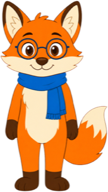
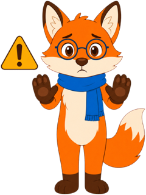
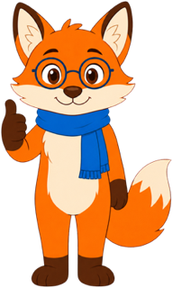

# Sage the Fox Mascot Style Guide

This page previews every mascot pose and its intended callout style.

!!! mascot-neutral "A Note from Sage"
    { class="mascot-admonition-img" }
    Use this style for a brief general note that does not need a stronger emotional cue.

!!! mascot-welcome "Welcome!"
    { class="mascot-admonition-img" }
    Let’s figure this out! We will look for patterns, represent them with symbols, and check what our answers mean.

!!! mascot-thinking "Key Insight"
    { class="mascot-admonition-img" }
    An equation is balanced. Whatever operation you perform on one side must also happen on the other side.

!!! mascot-tip "Sage’s Tip"
    { class="mascot-admonition-img" }
    Write one algebra step per line. A little extra space makes sign errors much easier to spot.

!!! mascot-warning "Common Mistake"
    { class="mascot-admonition-img" }
    A negative sign applies to every term inside the parentheses. Distribute it before combining like terms.

!!! mascot-encourage "Keep Going!"
    { class="mascot-admonition-img" }
    If the first method feels confusing, draw a model or make a table. Changing representations often reveals the pattern.

!!! mascot-celebration "Well Done!"
    { class="mascot-admonition-img" }
    You did more than find an answer—you explained why it works and checked it another way.
